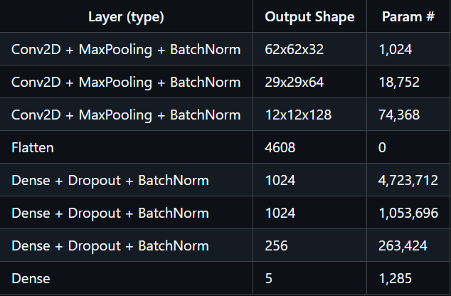
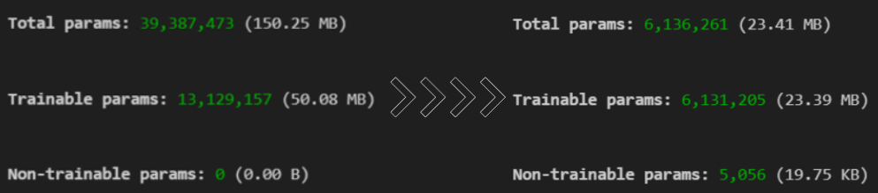

# Terrain-Classification

### Overview

This project employs a Convolutional Neural Network (CNN) to categorize terrain types from image inputs with high accuracy. Leveraging a dataset of 10,000 images spanning five terrain categories, the model delivers a validation accuracy of 84.62%, demonstrating impressive generalization and effective terrain discrimination.

Additionally, an alternate model achieves **91.93% validation accuracy** and **92.40% test accuracy** with a compact size of **15.6 MB**. For further details, refer to the [EfficientNet-B0 Model README](transfer_learning/ReadMe.md).

  

## Dataset

A custom dataset was assembled by collecting over 10,000 images from various online sources, categorized into Coast, Desert, Forest, Glacier, and Mountain. Python tools such as BeautifulSoup and Selenium were used to automate image acquisition. For robust training and evaluation, the dataset was divided into 10,000 training and 500 test images, ensuring diverse coverage for each terrain type.

  

## Model Architecture

<table>
  <tr>
    <td style="vertical-align: top;">
      <h3>Total Parameters</h3>
      <ul>
        <li>6,136,261 (23.41 MB)</li>
        <li>Trainable params: 6,131,205 (23.39 MB)</li>
        <li>Non-trainable params: 5,056 (19.75 KB)</li>
      </ul>
      
<strong>Note:</strong> The <code>None</code> in the output shape means batch size is dynamic during model training or inference.

    </td>
    <td style="text-align: right;">
      
    </td>
  </tr>
</table>

## Results

The model achieved an outstanding accuracy of 84.62% on the test dataset. This performance highlights the strength of the architecture, which was refined through thorough experimentation and optimization. The achieved results validate the model’s reliability in classifying a wide range of terrain images.

  

## Optimization

Over several development cycles, the architecture was made much more efficient, shrinking its size from **`150 MB`** down to **`23 MB`**. This considerable reduction is pivotal for deployment in mobile and edge scenarios, where memory and computation are limited.

  

Thanks to this optimization, the model is now ideally suited for real-world mobile applications while retaining high accuracy—an example of how careful design leads to versatile, production-ready machine learning solutions.

## Acknowledgments

This terrain classification project was created by Team "LearnX" for SIH: Deep learning for terrain classification.

### LearnX Lead: S Akash

  
Click to see the list of contributors

  
  - Vihaan Agrawal
  - Ruchi Chand Thakur
  - Manas Gupta
  - Tanmay Singh
  - Harshith Patnaik

